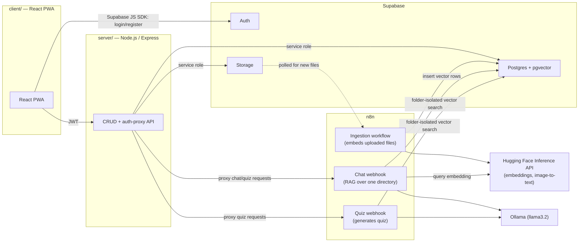
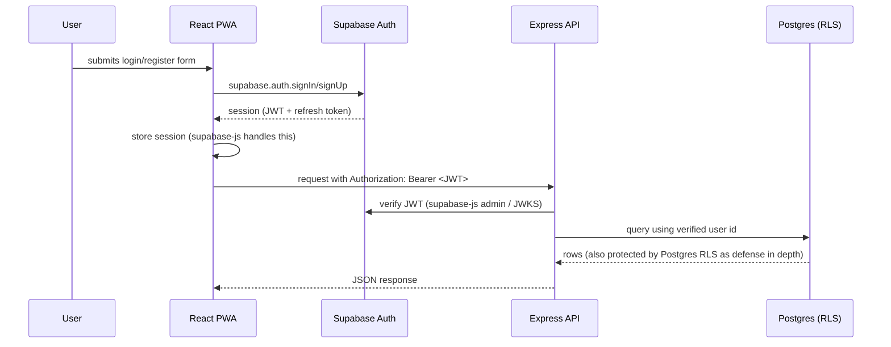
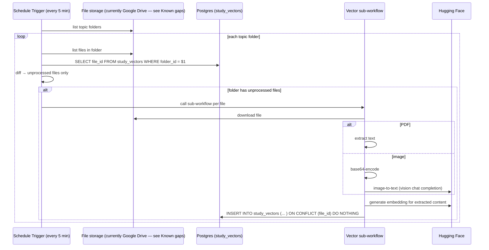
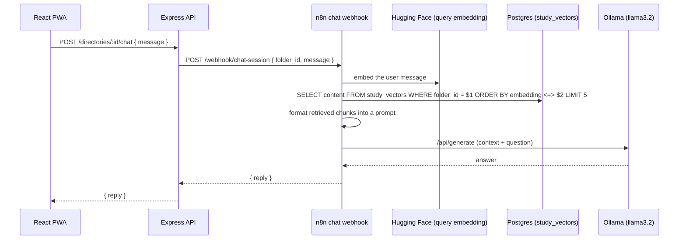

# Architecture

## Tech stack
| Layer | Choice |
|---|---|
| Client (`client/`) | React 19 + TypeScript + Vite, Tailwind CSS v4 (`@tailwindcss/vite`), built as a PWA |
| Server (`server/`) | Node.js + Express + TypeScript — thin CRUD/auth-proxy layer only |
| Database | Supabase Postgres (+ `pgvector`) — one instance for app data and embeddings |
| Auth | Supabase Auth (email/password) |
| File storage | Supabase Storage |
| AI / automation | n8n — owns all embedding generation, RAG chat, quiz generation |
| LLM / embeddings runtime | Ollama (local, `llama3.2`) for chat answers; Hugging Face Inference API for embeddings and image-to-text |

The server deliberately does **no** AI work. It validates the Supabase session, does directory/file CRUD against Postgres/Storage, and forwards chat/quiz requests to n8n webhooks so n8n's URL and credentials never reach the browser. See `docs/PRODUCT.md` for the feature/route breakdown and `docs/DATA.md` for the schema.

## System overview



## How the app runs

**Client** (`client/`):
```
cd client
npm run dev       # Vite dev server
npm run build      # tsc -b + production build
npm run lint
npm run preview
```

**Server** (`server/` — directory exists, Express app not yet scaffolded inside it): a standard Express + TypeScript app with its own `package.json`/`tsconfig.json`, independent of the client's Vite/TS config.

**n8n**: the two workflows in `n8n/` are imported into a running n8n instance (self-hosted or cloud) and activated. They call out to Postgres, Hugging Face, and a local Ollama instance (currently `http://host.docker.internal:11434`, i.e. n8n running in Docker reaching Ollama on the host).

**Environment variables** (target — none of this is wired up yet):
- `SUPABASE_URL`, `SUPABASE_ANON_KEY` — client (public)
- `SUPABASE_SERVICE_ROLE_KEY` — server only, never shipped to the client
- `N8N_CHAT_WEBHOOK_URL`, `N8N_QUIZ_WEBHOOK_URL` — server only, the Express layer's targets when proxying
- Hugging Face API key and Ollama host are n8n credentials/config, not app env vars

## Directory structure

Current repo root:
```
client/         # Vite React app (moved from repo root)
server/         # empty — Express app not yet scaffolded
n8n/            # exported n8n workflow JSON
docs/           # this documentation
README.md
```

Target, once the server and PWA scaffolding exist:
```
client/
  src/
    pages/        # Landing, Login, Register, Directory, Chat, Quiz
    components/
    lib/          # supabase client, api client
  public/
    manifest.json
    service-worker (or Vite PWA plugin output)
server/
  src/
    routes/     # directories, files, chat (proxy), quiz (proxy)
    middleware/ # supabase JWT verification
  package.json
  tsconfig.json
n8n/
docs/
README.md
```

## Auth flow

Supabase Auth issues the session; the server never sees a password, only verifies the JWT on each request.



Row-Level Security in Postgres is the actual data boundary (see `docs/DATA.md`); the Express layer's JWT check is a second gate, not the only one.

## Data flow: file ingestion (embedding pipeline)

This is what the existing `n8n/Multimodal RAG Quiz Workflow.json` + `... - Vector SubWorkflow.json` already implement, traced directly from the workflow JSON:



Today this is **poll-based** (every 5 minutes), not triggered instantly on upload. A future improvement is to have the server call an n8n webhook right after a Supabase Storage upload completes, instead of waiting on the poll — not yet implemented.

## Data flow: chat (RAG)



The vector search is scoped to a single `folder_id`, so one directory's chat can never see another directory's content — this isolation must be preserved in any future refactor.

## Known gaps between the existing n8n workflows and the target architecture
These are real, verified by reading the workflow JSON — not guesses — and should be resolved as part of building the app, not treated as already-correct:

1. **File storage is still Google Drive.** The ingestion workflow lists/downloads files from a hardcoded Google Drive folder. The target architecture uses Supabase Storage. The Drive nodes (`Search files and folders`, `Get Files In Topic Folder`, `Download File`) need to be replaced with Supabase Storage equivalents, and `folder_id`/`file_id` need to become Supabase `directories.id` / `files.id` (uuid) instead of Drive object IDs (string).
2. **Embedding model mismatch.** File ingestion embeds content with `sentence-transformers/all-MiniLM-L6-v2` (384 dimensions), but the chat path embeds the user's query with `sentence-transformers/all-mpnet-base-v2` (768 dimensions). A pgvector column has a fixed dimension, so these two paths currently cannot share one vector space correctly — one of them must change. Standardize on a single model (recommend `all-MiniLM-L6-v2`, 384-dim, since that's what's already used for indexing) before wiring this up against a real `vector(384)` column.
3. **No chat history persistence.** The n8n chat webhook is stateless per request (embed → search → answer, no memory). If the Chat page needs visible history, that's an app-side concern (see `chat_messages` table in `docs/DATA.md`), not something n8n currently provides.
4. **Quiz generation workflow doesn't exist yet.** Only the RAG chat and ingestion pipelines are built. The quiz workflow (generate questions from a directory's embedded content plus online sources) still needs to be authored in n8n.
